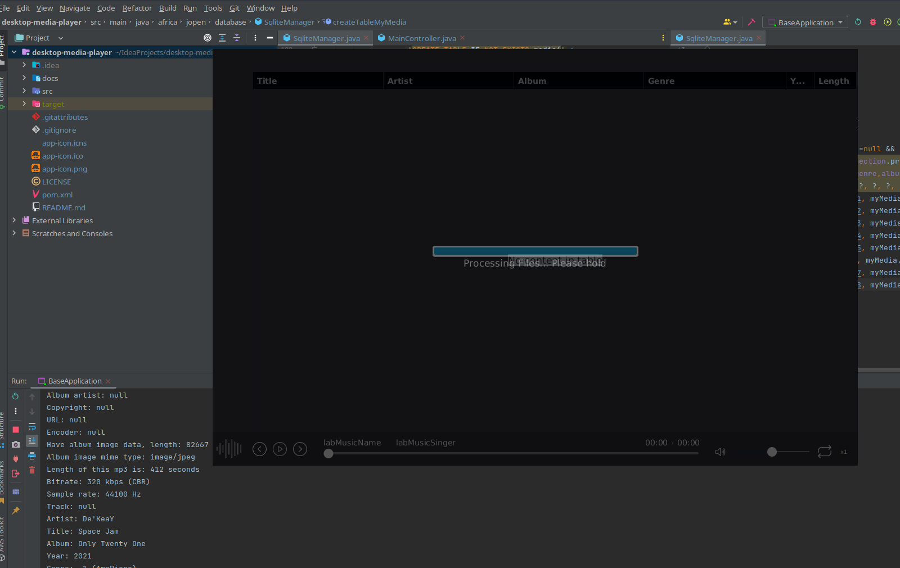
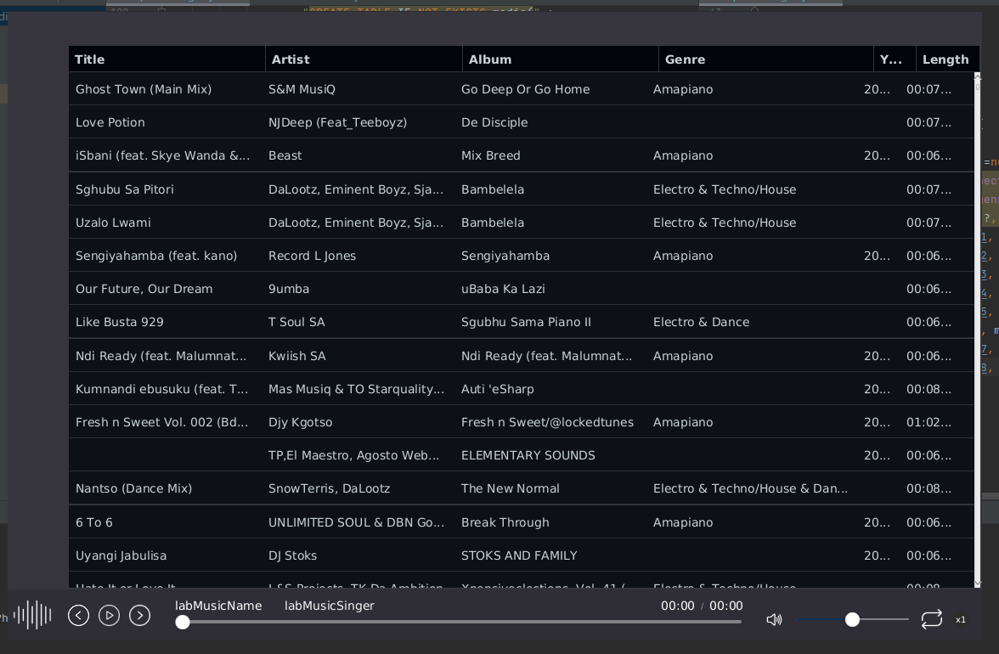
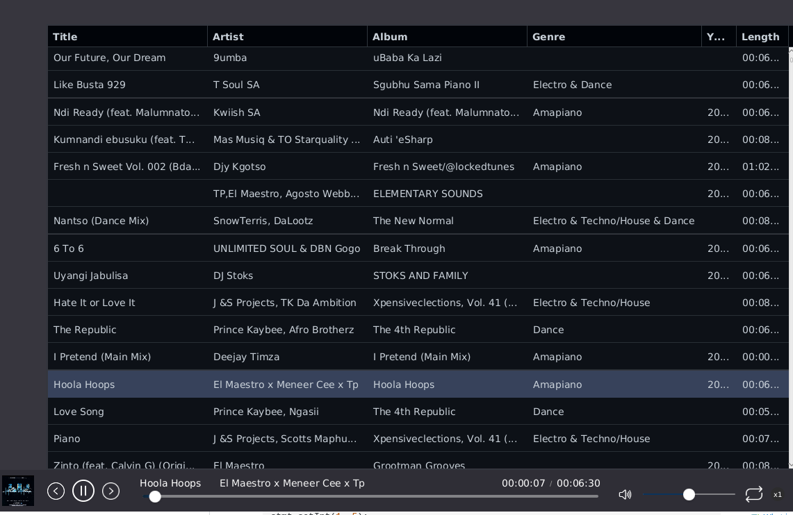

# Desktop Media  Player


<hr>

This is a simple cross-platform desktop media player made with [JavaFX](https://openjfx.io).
In the face or many media players this seeks to be a good starting point for any one who wishes to build from the simple version to something more complex that does what you want .

For me Music players they are very personal  and should cater to your needs/preferences as a user.


## **Motivation**

The reason for building this player for was to be to migrate my playlists when I do distro hopping (when I install a new Operating System). 
I have found it painfully to reset my long playlist that I would have built over time so to lose all of that just because the payer can't cater to a new file path and some don't even have the export playlist option,so the existing have been failing me .


Feel free to use this even for advanced reasons and make it better for you .

# Goals of the project 

1. Build nice, small cross-platform JavaFX or Swing desktop apps with native installers!
2. Just use Maven - no shell scripts required!
3. Use standard Maven dependency system to manage dependencies.
4. Generate [MacOS (.dmg), Windows (.msi) and Unix (e.g. deb/rpm)](https://github.com/wiverson/maven-jpackage-template/releases)
installers/packages in the cloud
with [GitHub Actions](https://github.com/wiverson/maven-jpackage-template/tree/main/.github/workflows).

Out of the box, this template generates "Hello World" installers - 30-40mb .dmg, .msi and .deb files. Check out the
example builds in
[releases](https://github.com/wiverson/maven-jpackage-template/releases).

If you are on MacOS, you notice the MacOS builds are not signed. Current versions of MacOS will report
installers downloaded via browsers as damaged/unopenable. You can [clear this flag via the command-line](docs/apple-sign-notarize.md). As this is not a reasonable solution for end users, a GitHub Action is included to notarize, sign, and staple 
MacOS installers, but the secrets aren't set up for this repository by default. You will need an Apple Developer account
to get this working. [More information on MacOS signing](docs/apple-sign-notarize.md).


## Requirements

- [Java 18](https://bell-sw.com/pages/downloads/#/java-18-current).
    - If you are using JavaFX, use an SDK that has JavaFX bundled:
      - [Liberica with JavaFX](https://bell-sw.com/pages/downloads/#/java-18-current)
      - [Azul Zulu with JavaFX](https://www.azul.com/downloads/?version=java-18-sts&package=jdk-fx)
    - If you are using Swing, pretty much any Java 17 or 18 JDK will work.
- [Maven](https://maven.apache.org/).
- On MacOS XCode is required.
- On Windows the free [WiX Toolset](https://wixtoolset.org/) is required.

## Installation

If you are on Windows, you will need to install Java, Maven, and Wix manually.

If you are on MacOS or Linux, you can use [SDKMAN!](https://sdkman.io/) to simplify installing Java and Maven. Once 
SDKMAN! is installed, you can run the following to install Liberica or Azul Zulu and Maven.

```bash
sdk install java 18.0.2.fx-librca
# or
sdk install java 18.0.2.fx-zulu
sdk current java
sdk install maven
```

## Installation Verification

1. Verify that Java is installed by opening a fresh Terminal/Command Prompt and enter `java --version`. As of this 
writing, the Java version should be 18.0.2 or later.
2. Verify that Maven is installed with `mvn --version`. Maven should be version 3.8.6 or later.
3. Install platform-specific tools.
   1. **MacOS only:** Verify that XCode is installed & license accepted by a) launching it and b)
      running `sudo xcodebuild -license`.
   2. **Windows only:** Install [Wix 3 binaries](https://github.com/wixtoolset/wix3/releases/).
4. Clone/download this project.
5. Run `mvn clean install` from the root of the project to generate the `target\TestApp.dmg` or `target\TestApp.msi`
   installers.
    - The generated installer will include a version number in the file name.
    - For reference, here is a complete run log for [a successful run](docs/sample-run.md).


On MacOS you should [add signing to avoid error messages](https://github.com/wiverson/maven-jpackage-template/issues/49)
related to the security system(s).

To [re]generate an installer, run...

`mvn clean install`

To do everything up until the actual installer generation (including generating the custom JVM)...

`mvn clean package`

To generate reports, include to check if you are using the current version[s] of your dependencies, run...

`mvn site`

...and open target/site/index.html to see the generated reports.

## Key Features

Here are few cool things in this template:

- Only uses Java and Maven. No shell scripts required.
- Includes sample [GitHub Actions](https://github.com/wiverson/maven-jpackage-template/tree/main/.github/workflows) to
  build MacOS, Windows and Linux installers. These GitHub Actions are configured to use the Liberica JDK 18 with 
JavaFX to simplify the build process. If you prefer to use Azul Zulu, modify the distribution name to `distribution: 'zulu'` as described on the [Usage description of setup-java](https://github.com/actions/setup-java/blob/main/docs/advanced-usage.md#Zulu) 
- Demonstrates setting the application icon
- Builds a .dmg on MacOS, .msi on Windows, and .deb on Linux, but can be easily tweaked to generate other jpackage
supported installers (e.g. .pkg)
- Includes a JavaFX demo to simplify getting started.
    - Just delete the JavaFX stuff if you are using Swing
- Template includes several examples of JavaFX / native desktop integration
    - Drag & drop with Finder / Explorer
    - Change the Dock icon dynamically on MacOS
    - Menu on the top for MacOS, in the window itself on Windows
    - Request user attention (bouncing dock icon) on MacOS
    - Removing the code and the demonstration dependencies gets a "Hello World" build size closer to 30mb than
      40mb.
- Java + Java modules are used to build a trimmed
  JVM ([a few thoughts on Java modules](https://changenode.com/articles/fomo-java-modules))
- The user application uses ordinary Maven dependencies and classpath to run the application
    - Nice illustration of how to use jlink to build a slim JVM, point jpackage at that JVM and still use the ordinary
      Maven managed classpath for the application

Once you get started, you might find these lists of tutorials, tools, libraries for
[JavaFX](https://gist.github.com/wiverson/6c7f49819016cece906f0e8cea195ea2)
and general [Java desktop integration](https://gist.github.com/wiverson/e9dfd73ca9a9a222b2d0a3d68ae3f129) helpful.

### Does this work with Apple Silicon aka M1/M2?

Yes, although as of this writing I don't believe there are GitHub Action runners that support M1. But building locally
on my M1/M2 systems works great and generates native Apple Silicon builds.

### Does this support MacOS signing, notarization, and stapling?

Yes, there is a GitHub Action and a Maven profile to assist with setting all of this up
for MacOS applications.

For more information, see
the [documentation on getting MacOS signing/notarization/stapling](/docs/apple-sign-notarize.md) set
up. It won't work out of the box, as you need to sign up for an Apple Developer account,
add a bunch of GitHub Secrets and update the pom.xml.

### What about Linux?

The JavaFX builds include several other architectures, including aarch64 and arm32. In theory,
you should be able to add those just like the other builds. Haven't tested it though, as I only use Linux for
server-side stuff. Feel free to post in
the [discussion](https://github.com/wiverson/maven-jpackage-template/discussions) section and
also check the [Q&A](docs/qna.md) if you are using Linux.

# Database 

Uses sqlite database

# Screenshots






# Debugging

1. If the built app fails to run, make sure the JavaFX app runs as expected first by using the `mvn javafx:run` command.
   This will run the app in development mode locally, and you should see standard System.out debug lines appear in your
   console.
    - Many flavors of Linux fail to run here for a variety of reasons. Head over to
      the [discussions](https://github.com/wiverson/maven-jpackage-template/discussions) or perhaps consider your
      [consulting budget](https://changenode.com) or
      a [JavaFX support contract from Gluon](https://gluonhq.com/services/javafx-support/).
2. Check the Maven build logs (of course).
3. By default, the app will generate debug*****.log files containing the output from System.out. You can look at the
   main method of `BaseApplication.java` to see how this is done. For a production app, you would want to place these
   logs in the correct OS specific location. On a Unix machine you can `tail -f` the log normally.


# Q&A

If you are using the template, browsing the [Q&A](docs/qna.md) is highly recommended.
